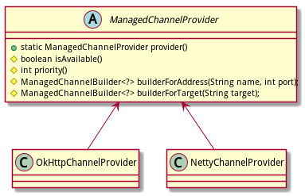

Channel Provider设计与代码实现
===========================

## 功能

Channel Provider 的功能在于帮助创建合适的 ManagedChannelBuilder。

所谓合适，是指目前有多套 Channel 的实现，典型如 netty 和 okhttp ，不排除未来加入其他实现的可能。因此, 如何选择哪套实现就是一个需要特别考虑的问题。

Channel Provider 的设计目标是解藕这个事情，不使用配置，hard code等方式，而是将细节交给 Channel Provider 的具体实现。

## 使用场景

在 ManagedChannelBuilder 中这样调用 ManagedChannelProvider：

```java
public abstract class ManagedChannelBuilder<T extends ManagedChannelBuilder<T>> {
  public static ManagedChannelBuilder<?> forAddress(String name, int port) {
    return ManagedChannelProvider.provider().builderForAddress(name, port);
  }
  public static ManagedChannelBuilder<?> forTarget(String target) {
    return ManagedChannelProvider.provider().builderForTarget(target);
  }
  ......
}
```

其中 provider() 静态方法会根据实际情况选择一套可用的方案，然后 builderForAddress()方法和 forTarget() 方法会创建对应的ManagedChannelBuilder (基于okjava或者netty)。

## 继承结构



结构简单，一个抽象基类 ManagedChannelProvider，然后 okjava 和 netty 各实现了一个子类。

具体实现看后面的代码分析。
